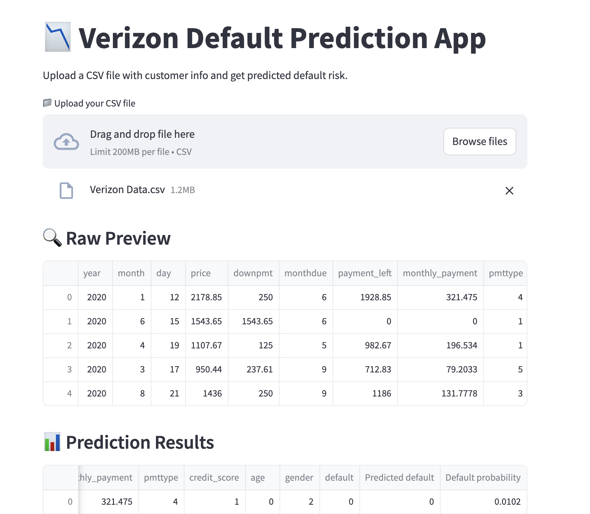

# Verizon Customer Default Prediction

## 🔍 Project Overview
This project predicts whether a Verizon customer is likely to default using transaction, payment, and demographic features. It combines a LightGBM machine learning model with a Streamlit web interface, deployed live for anyone to use.

## 🎯 Goal
Help the business identify at-risk customers early and proactively reduce financial loss by predicting default risk using historical data.

## 🧠 Model Used
- **LightGBM Classifier**
- Tuned using `GridSearchCV`
- Trained on ~17,000 records

## 📈 Performance
- AUC: **0.94**
- Recall (Class 1): **88%**
- Precision (Class 1): ~46%
- Optimized threshold for high-recall use case

## 🛠️ Tools & Tech
- Python
- LightGBM
- Scikit-learn
- Pandas, Seaborn
- Streamlit
- GitHub + Streamlit Cloud (for deployment)

## 💡 Key Features
- Interactive web app (upload CSV and get predictions)
- Model trained on structured tabular data
- Custom probability threshold tuning
- Clean user-facing output with downloadable predictions

## 🌐 Live Demo
👉 [Click here to try the app](https://verizonchurnrateanalysis-zepqjpvmuxktdxenfwtkub.streamlit.app/)

## 📁 GitHub Repo
👉 [github.com/yourusername/verizon-default-prediction](https://github.com/Qinkai-Yin?tab=repositories)

## 🧩 Sample Use Cases
- Internal credit risk scoring
- Customer segmentation for outreach
- Loan underwriting automation

---
